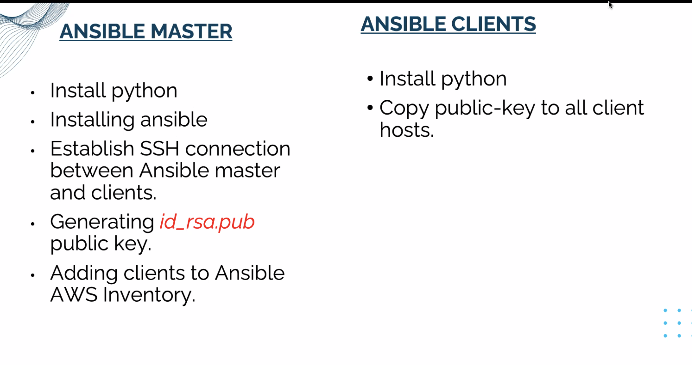

##   Ansible

Ansible is an open source software tools that enable infrastructure as code. 
With ansible you can configure, provision and mange multiple server with one controller.

Playbook: is a YAML file that provide instruction to ansible.
Play:series of steps to be performed on a host or group of hosts(Name, hosts and Tasks)
Task: Single action to be performed on a hosts

Ansible is Idempotent!! Ansible is smart to recogniaze changes and only update those changes and if there is no change since last deplyement, no action is performed.


Ansible Variables are use to specify value at run time. 
For best practices, use variable file to specify all the variable and call them in the each play. 
The variable file need to be in the same path as the playbook file.

Handlers are tasks that only run when notified


Roles is use when working with extensive playbooks by spliting tasks. Roles can be reusable and follow a particular directory structure. ansible-galaxy init role_name

### Ansible Homework 

HOMEWORK1:
Setup an Ansible cluster with the controller running amazon linux 2 and the 4 nodes - 2 running amazon linux 2 and 2 others running ubuntu.





1 - install python on the controller running (amazon linux 2)  
   `sudo yum install python3`  
2 Install ansible  https://docs.ansible.com/ansible/latest/installation_guide/installation_distros.html#installing-ansible-on-ubuntu

  - intall epel-release first   
  ```
  amazon-linux-extras install epel     
  sudo yum install epel-release     
  sudo yum install ansible
  ```
2 - Establishing SSH connection between Ansible controller and clients   

   - ceheck ansible version ` ansible --version `
   - Go into config file ` cd /etc/ansible/`
  
3 - Generate public key
   `ssh-keygen`
   copy the public key to all 4 clients under authorizedkey file   
   check if you can connect to each instance from the controller using `ssh root@"ip of your client"`  
4 - Adding clients to ansible

   - Go into config file ` cd /etc/ansible/`
   - `vi hosts` and modify hosts to insert ip address of ansible clients

### Ping all nodes
  `ansible -m ping all` 

  

`ansible -m ping "node name'`

 


## part 2

Write an Ansible playbook with two plays.   
PLAY1 - configure apache on amazon linux hosts  
PLAY2 - configure apache on ubuntu hosts  
PLAY3 - install GIT on all hosts. 

PLAY1  


PLAY2  


PLAY3  


## other Command
`hostnamectl` to view the server information  
To change the sever name
` hostnamectl set-hostname "name of your controller"`
